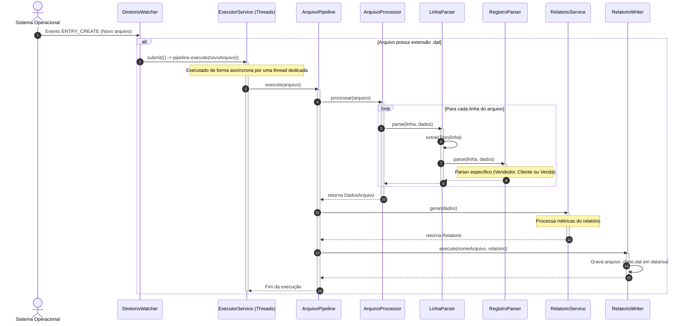

# Analisador de Dados

[](https://circleci.com/gh/liviasilvasantos/desafio-agibank-002)
[](https://codecov.io/gh/liviasilvasantos/desafio-agibank-002)

Sistema de análise de dados que monitora continuamente um diretoório, importa arquivos `.dat`, processa registros de vendedores, clientes e vendas, e gera relatórios automaticamente.

## Como compilar e executar

### Pré-requisitos

- Java 17+
- Maven 3.8+

### Compilar

```bash
mvn clean package
```

### Executar

```bash
java -jar target/analisador-de-dados-1.0.0.jar
```

A aplicação irá:
1. Criar os diretórios `%HOMEPATH%/data/in` e `%HOMEPATH%/data/out` se não existirem.
2. Processar todos os arquivos `.dat` encontrados em `%HOMEPATH%/data/in`.
3. Monitorar continuamente o diretório para novos arquivos.

### Como executar os testes

**Testes unitários:**
```bash
mvn test
```

**Testes unitários + integração + cobertura:**
```bash
mvn verify
```

O relatório de cobertura JaCoCo será gerado em `target/site/jacoco/index.html`.

---

## Estrutura do projeto

A solução foi organizada em camadas com responsabilidades bem definidas:

```
src/main/java/com/analisador/
    config/ -> Configuração externalizada (AppConfig)
    domain/ -> Modelos de domínio (records e POJOs)
    parser/ -> Parsers de cada tipo de registro (Strategy Pattern)
    service/ -> Lógida de negócio (processamento de arquivos, geração de relatórios)
    watcher/ -> Monitoramento de diretório (WatchService)
    Application.java -> Ponto de entrada da aplicação
```

---

## Fluxo de Processamento

O diagrama de sequência a seguir ilustra o fluxo de execução assíncrono que ocorre na aplicação sempre que um novo arquivo com extensão `.dat` é adicionado ao diretório de entrada (`data/in`):


---

## Decisões de arquitetura

### Padrões de Arquitetura e de Projeto

A estrutura segue o princípio de **separação por camada de responsabilidade**, organizando o código em pacotes coesos:

- **domain**: Contém apenas modelos de dados sem lógica de infraestrutura. Usa Java Records para imutabilidade e concisão, reduzindo *boilerplate*.
- **parser**: Isola a lógica de parsing de cada tipo de registro, permitindo fácil adição de novos tipos no futuro. Cada parser implementa uma interface comum, facilitando testes unitários.
- **service**: Contém a lógica de negócio, como processamento de arquivos e geração de relatórios. Depende apenas da camada de domínio e dos parsers.
- **watcher**: Responsável por monitorar o diretório de entrada e acionar o processamento de arquivos. Mantém baixo acoplamento com a camada de serviço.
- **config**: Contém a configuração externalizada da aplicação, como diretórios de entrada e saída.

#### Strategy Pattern (Padrão Comportamental)

É aplicado na interface `RegistroParser.java` e suas implementações concretas (`ClienteParser.java`, `VendedorParser.java`e `VendaParser.java`), gerenciados pela classe `LinhaParser.java`. A classe `LinhaParser.java` mantém um mapa das estratégias de parser de linha por código (001, 002, 003). Ao ler uma linha, ela extrai o código do registro e delega o parsing dinamicamente para o parser correspondente.

**Vantagens:**
- **Open/Closed Principle (SOLID)**: Permite adicionar novos tipos de registros no futuro sem alterar o código do `LinhaParser.java` ou dos parsers existentes.
- **Baixo Acoplamento** e **Alta Testabilidade**: A lógica de parsing de cada tipo de dado fica isolada, e facilita a escrita de testes unitários específicos para cada layout de linha.

#### Pipeline Pattern (Padrão de Processamento em Etapas)

É aplicado na classe `ArquivoPipeline.java`. O ciclo de vida do processamento de um arquivo é dividido em uma sequência encadeada de passos:
- Leitura/Parsing (`ArquivoProcessor.java`)
- Cálculo de Métricas (`RelatorioService.java`)
- Escrita do relatório no disco (`RelatorioWriter.java`)

**Vantagens:**
- **Separação de responsabilidades**: Cada componente cuida exclusivamente de uma fase do fluxo de dados.
- **Extensibilidade**: Facilita a inclusáo de novas etapas intermediárias (como validação de esquemas, auditoria ou armazenamento em banco de dados), com impacto mínimo na arquitetura.

Poderia usar também uma *Chain of Responsabilitity*.

#### Injeção de Dependência via construtor

Em praticamente todas as classes de serviço e infraestrutura, é usada a injeção de dependência via construtor. As dependências de um componente são passadas explicitamente através de seu construtor, em vezes de serem instanciados com *new* internamente.

**Vantagens:**
- **Testabilidade via Mocks/Stubs**: Permite injetar facilmente dependências simuladas em testes de unidade e integração.
- **Inversão de Controle (IoC)**: Torna as dependências explícitas e evita o acoplamento rígido entre classes.

#### Producer/Consumer - Concorrência com Thread Pool

É aplicado na classe `DiretorioWatcher.java` utilizando `ExecutorService (Executors.newCachedThreadPool())`. A thread de monitoramento (Produtora) escuta novos eventos no diretório. Ao identificar um arquivo `.dat`, submente a tarefa de processamento (`executor.submit(...)`) para o pool de worker threads (Consumidoras).

**Vantagens:**
- **Não bloqueante**: O monitoramento de novos arquivos continua ativo, mesmo durante o processamento de arquivos extensos.
- **Processamento Paralelo**: Permite processar múltiplos arquivos simultaneamente, aproveitando os núcleos da CPU.

#### Event-Driven Architecture (com NIO WatchService)

É aplicado no componente `DiretorioWatcher.java`. Utiliza o suporte nativo do sistema operacional (`java.nio.file.WatchService`) para ser notificado sobre eventos do sistema de arquivos (`ENTRY_CREATE`).

**Vantagens:**
- Evita a necessidade de *polling* constante (loops ativos verificando se surgiram arquivos no disco), reduzindo drasticamente o uso desnecessário de CPU e I/O.

#### Padrões de Domínio e Idiomas Modernos do Java (Java Records e Graceful Shutdown)

- **Imutabilidade com Java Records**: Os modelos em `domain` (`Cliente.java`, `Vendedor.java`, `Venda.java`) são implementados como Java Records. Garantindo imutabilidade nativa, elimina código boilerplate (`equals`, `hashCode`, `toString`) e assegura thread-safety ao trafegar dados entre threads.
- **Graceful Shutdown**: Registro de `Application.java` através de `Runtime.getRuntime().addShutdownHook`. Garante que o pool de threads e os recursos de monitoramento sejam **finalizados** adequadamente caso o processo seja interrompido pelo sistema operacional.

---

## Uso de IA

Este projeto foi desenvolvido com o auxílio de IA (Github Spec Kit e Devin) para:

- **Geração automática de código inicial**: A IA ajudou a criar a estrutura inicial do projeto, incluindo pacotes, classes e métodos.
- **Implementação dos parsers e serviços**: A IA sugeriu implementações para os parsers de registros e para a lógica de processamento de arquivos.
- **Testes unitários e de integração**: A IA auxiliou na criação de testes para validar a funcionalidade dos parsers e serviços, garantindo cobertura adequada.
- **Configuração CI/CD**: A IA ajudou a configurar o CircleCI para integração contínua e geração de relatórios de cobertura com Codecov.

Todo o código gerado foi revisado manualmente, linha a linha, para garantir que a lógica de parsing, cálculo de vendas e geração de relatório estivesse coerente com o desafio.
